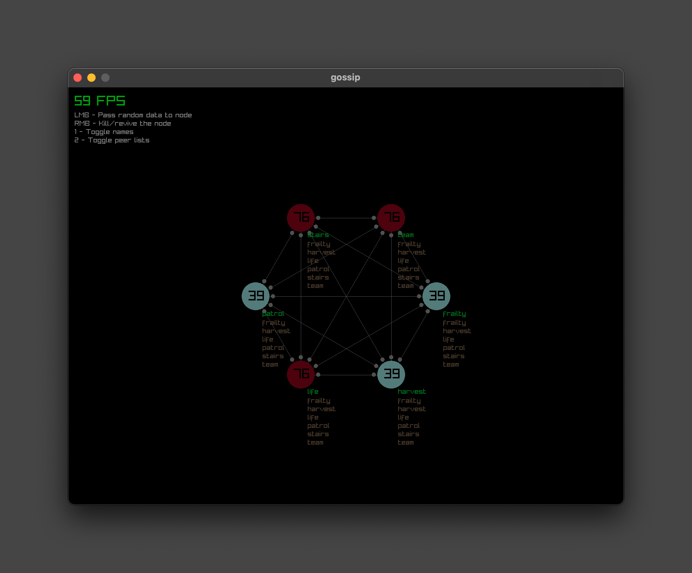

# Gossip protocol
Gossip protocol is a gossip protocol. The main point of the protocol is that 
thingy called gossip. Good protocol, I like it.

## Usage

Just run `make`. 

Or you can run it without cloning the repo:

```
go run github.com/tymbaca/gossip@latest
```

You can do stuff with nodes: add them, remove them, toggle them (like if the 
node goes down temporarily) and send a random data to them. Controls are on your 
screen. Good luck.



